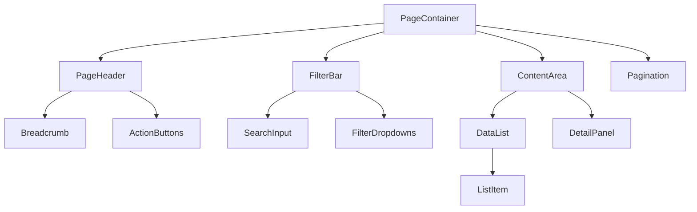
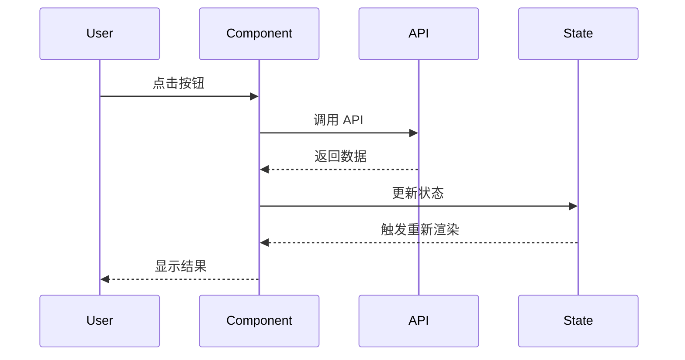

# 功能架构设计规范

当用户提出大型功能需求时，系统化地进行需求分析、技术选型、架构设计和任务拆分。

## 🎯 核心目标

1. **需求澄清** - 确保完全理解用户需求和业务价值
2. **技术调研** - 分析现有代码，识别可复用模块
3. **架构设计** - 设计清晰的模块划分和数据流
4. **任务拆分** - 生成可执行的开发任务清单
5. **风险评估** - 识别技术风险和缓解措施

## 📋 工作流程

### 第一步：需求分析与澄清

**必须明确的问题：**

1. **功能目标**
   - 这个功能要解决什么问题？
   - 核心业务价值是什么？
   - 目标用户是谁？

2. **用户场景**
   - 用户如何使用这个功能？
   - 典型的操作流程是什么？
   - 有哪些边界情况？

3. **功能边界**
   - 哪些功能是必须的（MVP）？
   - 哪些功能是可选的？
   - 与现有功能如何集成？

4. **非功能性需求**
   - 性能要求（响应时间、并发量）
   - 安全要求（权限控制、数据加密）
   - 可访问性要求
   - 国际化要求

**输出：需求清单**
```markdown
## 功能需求
1. [必须] 用户可以...
2. [必须] 系统应该...
3. [可选] 支持...

## 非功能性需求
- 性能：页面加载时间 < 2s
- 安全：需要权限验证
- 可访问性：支持键盘导航
- 国际化：支持中英文
```

### 第二步：技术调研

**调研清单：**

1. **现有代码分析**
   - 检查 `src/pages/` 下是否有类似功能
   - 检查 `src/components/` 下可复用的组件
   - 检查 `src/api/` 下相关的 API 接口
   - 检查 `src/hooks/` 下可复用的 Hooks
   - 检查 `src/utils/` 下可复用的工具函数

2. **技术栈评估**
   - UI 组件：Arco Design + @ceai-front/arco-material
   - 状态管理：React Context + useState（局部状态优先）
   - 样式方案：Tailwind CSS（主要）+ Less/CSS（复杂样式）
   - 国际化：i18next
   - 路由：React Router

3. **第三方库评估**
   - 优先使用项目已有依赖
   - 如需新增依赖，评估：
     - 库的维护状态
     - 打包体积
     - TypeScript 支持
     - 与现有技术栈的兼容性

4. **API 设计**
   - 需要哪些后端接口？
   - 请求/响应格式是什么？
   - 是否需要 WebSocket 或 SSE？

**输出：技术调研报告**
```markdown
## 可复用模块
- 组件：`src/components/data-directory-tree`
- Hooks：`src/hooks/usePermission.ts`
- API：`src/api/dataApi.ts`
- 工具：`src/utils/format.ts`

## 技术选型
- 状态管理：使用 React Context（局部状态）
- 表单处理：Arco Design Form
- 数据请求：useEffect + useState

## 新增依赖
- 无需新增依赖（或列出需要的依赖）
```

### 第三步：模块拆分

**按项目结构拆分：**

```
功能模块
├── API 层 (src/api/)
│   ├── 接口定义
│   ├── 请求函数
│   └── 类型定义
│
├── 类型定义 (src/types/)
│   ├── API 类型
│   ├── 组件 Props 类型
│   └── 业务模型类型
│
├── 状态管理 (Context 或组件内)
│   ├── Context Provider（如需要）
│   └── 局部状态（useState）
│
├── 页面组件 (src/pages/)
│   ├── 页面容器组件
│   └── 页面特定组件
│
├── 通用组件 (src/components/)
│   ├── 可复用组件
│   └── 组件样式（index.less）
│
├── Hooks (src/hooks/)
│   └── 自定义 Hooks
│
└── 工具函数 (src/utils/)
    └── 业务逻辑工具
```

**模块职责定义：**

每个模块必须明确：
- **输入**：接收什么数据/参数
- **输出**：返回什么数据/结果
- **职责**：负责什么功能
- **依赖**：依赖哪些其他模块

### 第四步：组件架构设计

**组件层级设计：**

```
PageContainer (页面容器)
├── PageHeader (页面头部)
│   ├── Breadcrumb (面包屑 - 使用 BreadcrumbCom)
│   └── ActionButtons (操作按钮)
│
├── FilterBar (筛选栏 - 可复用 ListHeader)
│   ├── SearchInput (搜索框)
│   └── FilterDropdowns (筛选下拉)
│
├── ContentArea (内容区域)
│   ├── DataList (数据列表)
│   │   └── ListItem (列表项)
│   │       ├── ItemHeader
│   │       ├── ItemContent
│   │       └── ItemActions
│   │
│   └── DetailPanel (详情面板)
│       ├── DetailHeader
│       └── DetailContent
│
└── Pagination (分页 - 使用 Arco Pagination)
```

**组件设计原则：**

1. **单一职责**
   - 每个组件只负责一个功能
   - 容器组件负责数据和逻辑
   - 展示组件负责 UI 渲染

2. **可复用性**
   - 通用组件放在 `src/components/`
   - 页面特定组件放在页面目录下的 `components/`
   - 通过 Props 提供灵活性

3. **可测试性**
   - 逻辑与 UI 分离
   - 纯函数优先
   - 避免副作用

4. **可维护性**
   - 清晰的命名
   - 完整的类型定义
   - JSDoc 注释说明组件用途

**组件接口设计：**

```typescript
// 容器组件
export type PageContainerProps = {
  // 最小化 props，大部分状态在组件内管理
};

// 展示组件
export type DataListProps = {
  data: DataItem[];
  loading: boolean;
  onItemClick: (item: DataItem) => void;
  onItemDelete: (id: string) => void;
  className?: string;
};

// 通用组件
export type FilterBarProps = {
  filters: FilterConfig[];
  values: FilterValues;
  onChange: (values: FilterValues) => void;
  className?: string;
};
```

### 第五步：数据流设计

**数据流向图：**

```
用户操作
  ↓
事件处理函数 (handleClick)
  ↓
API 调用 (src/api/)
  ↓
状态更新 (setState)
  ↓
组件重新渲染
  ↓
UI 更新
```

**状态管理策略：**

1. **服务端状态**（从 API 获取的数据）
   - 使用 useEffect + useState
   - 或封装成自定义 Hook

2. **客户端状态**（UI 状态）
   - **局部状态**：使用 useState（组件内部状态）
   - **跨组件状态**：使用 Context API
   - **全局状态**：使用 Redux（如果项目已使用）

3. **表单状态**
   - 使用 Arco Design Form
   - 或使用 useState 管理

4. **URL 状态**（筛选、分页等）
   - 使用 React Router 的 useHistory/useLocation
   - 便于分享和书签

**数据流示例：**

```typescript
// 1. API 层 (src/api/feature.ts)
import request from '@/utils/request';

export async function fetchDataList(params: QueryParams) {
  return request.get('/api/data/list', { params });
}

export async function createData(data: CreateDataParams) {
  return request.post('/api/data/create', data);
}

// 2. 类型定义 (src/types/feature.ts)
export type DataItem = {
  id: string;
  name: string;
  status: 'active' | 'inactive';
  createdAt: string;
};

export type QueryParams = {
  page: number;
  pageSize: number;
  keyword?: string;
};

// 3. 自定义 Hook (src/hooks/useDataList.ts)
import { useState, useEffect } from 'react';
import { fetchDataList } from '@/api/feature';
import type { DataItem, QueryParams } from '@/types/feature';

export function useDataList(params: QueryParams) {
  const [data, setData] = useState<DataItem[]>([]);
  const [loading, setLoading] = useState(false);
  const [error, setError] = useState<Error | null>(null);
  
  useEffect(() => {
    setLoading(true);
    fetchDataList(params)
      .then(setData)
      .catch(setError)
      .finally(() => setLoading(false));
  }, [params]);
  
  return { data, loading, error };
}

// 4. 容器组件 (src/pages/feature/index.tsx)
import React, { useState } from 'react';
import { useDataList } from '@/hooks/useDataList';
import DataList from './components/DataList';

const FeaturePage: React.FC = () => {
  const [filters, setFilters] = useState({ page: 1, pageSize: 20 });
  const { data, loading } = useDataList(filters);
  
  return (
    <div className="p-6">
      <DataList
        data={data}
        loading={loading}
        onFilterChange={setFilters}
      />
    </div>
  );
};

export default FeaturePage;
```

### 第六步：生成技术方案文档

**文档结构：**

```markdown
# [功能名称] 技术方案

## 1. 功能概述
- 功能描述
- 业务价值
- 用户场景

## 2. 需求分析
### 2.1 功能性需求
- [必须] ...
- [可选] ...

### 2.2 非功能性需求
- 性能要求
- 安全要求
- 可访问性要求

## 3. 技术调研
### 3.1 现有代码分析
- 可复用组件
- 可复用 Hooks
- 可复用工具函数

### 3.2 技术选型
- 状态管理方案
- 样式方案
- 第三方库

## 4. 架构设计
### 4.1 模块划分
- API 层
- 类型定义
- 状态管理
- 组件层
- Hooks
- 工具函数

### 4.2 组件层级
```
[组件树图]
```

### 4.3 数据流
```
[数据流图]
```

## 5. 接口设计
### 5.1 API 接口
| 接口 | 方法 | 路径 | 说明 |
|------|------|------|------|
| 获取列表 | GET | /api/data/list | ... |

### 5.2 类型定义
```typescript
export type DataItem = {
  id: string;
  name: string;
  // ...
};
```

## 6. 开发计划
### 6.1 任务拆分
- [ ] 1. API 层开发
  - [ ] 1.1 定义 API 接口
  - [ ] 1.2 实现请求函数
- [ ] 2. 类型定义
- [ ] 3. 组件开发
  - [ ] 3.1 页面容器组件
  - [ ] 3.2 列表组件
  - [ ] 3.3 详情组件
- [ ] 4. 样式开发
- [ ] 5. 国际化
- [ ] 6. 测试

### 6.2 优先级
1. **P0（必须）**：核心功能
2. **P1（重要）**：重要功能
3. **P2（可选）**：优化项

### 6.3 预估工作量
- API 层：0.5 天
- 组件开发：2 天
- 样式和国际化：0.5 天
- 测试和优化：1 天
- **总计：4 天**

## 7. 风险评估
### 7.1 技术风险
- **风险**：性能问题（大数据量渲染）
- **缓解措施**：虚拟滚动、分页加载

### 7.2 兼容性风险
- **风险**：浏览器兼容性
- **缓解措施**：使用 polyfill

## 8. 后续优化
- 性能优化
- 用户体验优化
- 功能扩展
```

### 第七步：生成开发任务清单

**任务清单格式：**

```markdown
# [功能名称] 开发任务

## 阶段一：基础架构（P0）
- [ ] 1. API 层开发
  - [ ] 1.1 在 `src/api/` 创建 API 文件
  - [ ] 1.2 定义 API 接口函数
  - [ ] 1.3 定义请求/响应类型
- [ ] 2. 类型定义
  - [ ] 2.1 在 `src/types/` 创建类型文件
  - [ ] 2.2 定义业务模型类型
  - [ ] 2.3 定义组件 Props 类型

## 阶段二：核心功能（P0）
- [ ] 3. 页面容器组件
  - [ ] 3.1 创建页面目录结构
  - [ ] 3.2 实现页面容器组件
  - [ ] 3.3 实现数据获取逻辑
- [ ] 4. 列表组件
  - [ ] 4.1 实现列表容器组件
  - [ ] 4.2 实现列表项组件
  - [ ] 4.3 实现筛选功能
  - [ ] 4.4 实现分页功能

## 阶段三：详情功能（P1）
- [ ] 5. 详情组件
  - [ ] 5.1 实现详情容器组件
  - [ ] 5.2 实现详情展示组件
  - [ ] 5.3 实现编辑功能

## 阶段四：样式和国际化（P0）
- [ ] 6. 样式开发
  - [ ] 6.1 使用 Tailwind CSS 实现基础样式
  - [ ] 6.2 实现响应式布局
  - [ ] 6.3 实现交互状态样式
- [ ] 7. 国际化
  - [ ] 7.1 提取文案到翻译文件
  - [ ] 7.2 添加中文翻译
  - [ ] 7.3 添加英文翻译

## 阶段五：测试和优化（P1）
- [ ] 8. 测试
  - [ ] 8.1 功能测试
  - [ ] 8.2 边界情况测试
  - [ ] 8.3 可访问性测试
- [ ] 9. 性能优化
  - [ ] 9.1 代码分割
  - [ ] 9.2 图片优化
  - [ ] 9.3 渲染优化

## 阶段六：文档和发布（P2）
- [ ] 10. 文档
  - [ ] 10.1 编写使用文档
  - [ ] 10.2 编写 API 文档
- [ ] 11. 发布准备
  - [ ] 11.1 代码审查
  - [ ] 11.2 测试验证
  - [ ] 11.3 部署上线
```

## 📊 项目特定规范

### 技术栈
- **React 18 + TypeScript**
- **UI 组件库**：Arco Design（主要）+ @ceai-front/arco-material
- **状态管理**：React Context + useState/useReducer（局部状态优先）
- **样式方案**：Tailwind CSS（主要）+ Less/CSS（复杂样式）
- **国际化**：i18next
- **路由**：React Router
- **工具库**：classnames（类名合并）、dayjs（日期处理）

### 代码规范
- 使用 TypeScript，Props 使用 `type` 或 `interface` 定义
- 遵循 ESLint 和 Prettier 配置
- 组件使用函数式组件 + Hooks
- 组件使用 `React.FC<Props>` 类型注解
- 组件导出使用 `React.memo` 包裹
- 文件命名：kebab-case（如 `user-card/index.tsx`）
- 组件命名：PascalCase（如 `UserCard`）
- 函数/变量命名：camelCase（如 `handleClick`）

### 目录结构约定
```
src/
├── api/              # API 接口（按模块划分）
│   ├── app.ts
│   ├── user.ts
│   └── modules/      # 子模块
├── components/       # 通用组件
│   └── component-name/
│       ├── index.tsx
│       └── index.less (可选)
├── pages/            # 页面组件
│   └── page-name/
│       ├── index.tsx
│       └── components/ (页面特定组件)
├── hooks/            # 自定义 Hooks
├── utils/            # 工具函数
├── types/            # 类型定义
├── store/            # 状态管理
├── assets/           # 静态资源（SVG、图片）
├── style/            # 全局样式
└── config/           # 配置文件
```

### 组件开发规范
- 每个组件一个文件夹，包含 `index.tsx`
- 样式文件：`index.less` 或 `index.css`（仅复杂样式）
- 优先使用 Tailwind CSS 类名
- 导出 Props 类型：`export type ComponentNameProps`
- 使用 JSDoc 注释说明组件用途
- 使用 `cn()` 或 `classnames` 合并类名

### API 调用规范
- 使用 `src/utils/request.ts` 封装的请求方法
- API 函数放在 `src/api/` 对应模块文件
- 定义清晰的请求/响应类型（放在 `src/types/`）
- 统一错误处理（使用 Arco Message 组件）
- API 函数命名：动词开头（如 `fetchUserList`、`createApp`）

### 样式规范
- **优先级**：Arco Design 组件 > Tailwind CSS > Less/CSS
- **颜色变量**：使用 CSS 变量（如 `var(--color-text-2)`、`var(--primary-6)`）
- **间距**：使用 Tailwind 类（如 `gap-3`、`p-4`、`m-2`）
- **字体大小**：`text-[12px]`、`text-[14px]`、`text-[16px]`
- **圆角**：`rounded-[4px]`（常用）、`rounded-[8px]`
- **响应式**：使用 `mobile:`、`tablet:`、`pc:` 断点
- **Less 文件**：仅用于 Tailwind 无法实现的复杂样式

### 国际化
- 所有文案使用 i18next
- 翻译文件：`locales/zh/plugin__console-plugin-appforge.json`
- 使用 `useTranslation` hook
- 翻译 key 使用点分隔（如 `common.confirm`、`page.title`）

### 权限控制
- 使用 `PermissionWrapper` 组件包裹需要权限的元素
- 权限配置在 `src/config/permissions.ts`
- 使用 `usePermission` hook 检查权限

## ✅ 检查清单

完成架构设计后，确保：

- [ ] 需求已完全理解和澄清
- [ ] 技术调研已完成，识别了可复用模块
- [ ] 模块划分清晰，职责明确
- [ ] 组件层级合理，符合单一职责原则
- [ ] 数据流设计清晰，状态管理方案合理
- [ ] API 接口设计完整，类型定义清晰
- [ ] 任务拆分合理，优先级明确
- [ ] 风险已识别，有缓解措施
- [ ] 文档完整，可直接指导开发
- [ ] 符合项目现有规范和代码风格

## 🚫 禁止事项

- ❌ 不要跳过需求澄清阶段
- ❌ 不要忽略现有代码的复用
- ❌ 不要过度设计（YAGNI 原则）
- ❌ 不要忽略非功能性需求
- ❌ 不要忽略风险评估
- ❌ 不要生成无法执行的任务
- ❌ 不要忽略项目现有规范
- ❌ 不要使用 CSS Modules（项目使用 Less/CSS）
- ❌ 不要忽略权限控制
- ❌ 不要忽略国际化

## 💡 Mermaid 图表示例

**组件层级图：**


**数据流图：**


---

**记住：生成的技术方案必须是可执行的，任务清单必须是可直接开发的，并且完全符合项目现有规范。**
